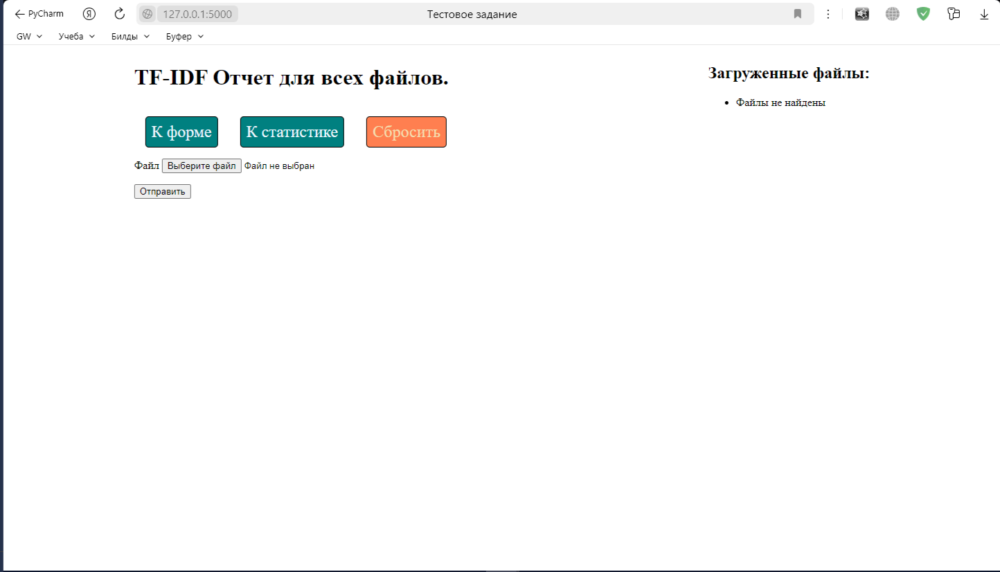
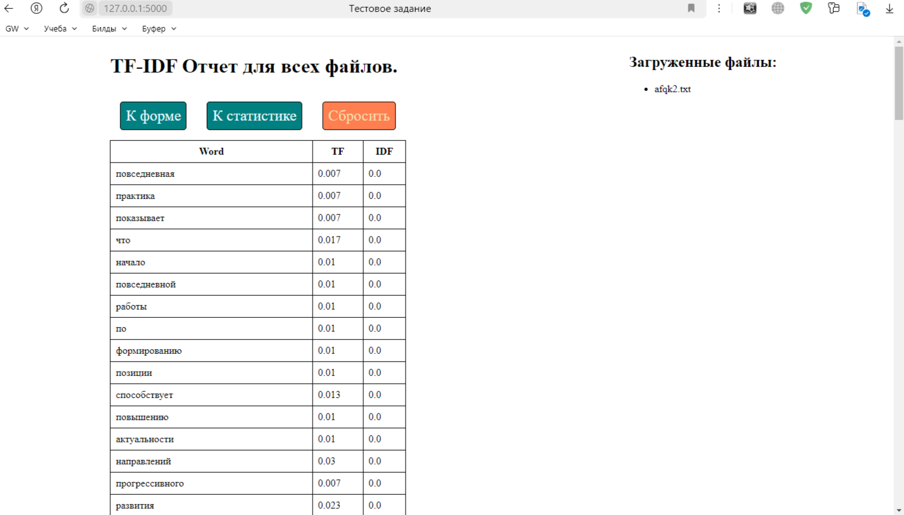
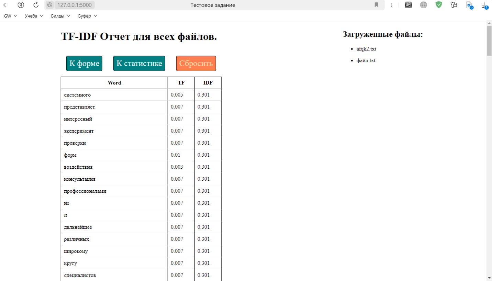
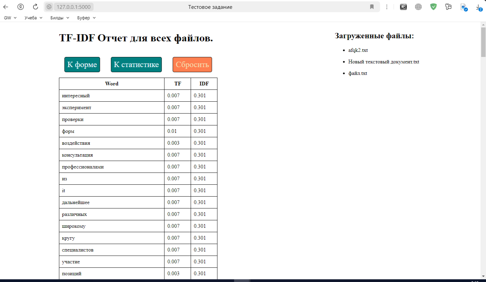

# Тестовое задание от Lesta Games

## Задание:
### Требования к кандидату
* Знание основ языка программирования Python
* Опыт работы с Базами Данных 
* Знание любого веб фреймворка (django, flask, fastapi etc)
* Знание жизненого цикла веб запроса
* Выполненное тестовое задание

### Тестовое задание
Реализовать веб-приложение. В качестве интерфейса сделать страницу с формой для загрузки текстового файла, после загрузки и обработки файла отображается таблица с 50 словами с колонками:
- слово
- tf, сколько раз это слово встречается в тексте
- idf, обратная частота документа 

Вывод упорядочить по уменьшению idf.

Ознакомиться с tfidf можно здесь: [tfidf](https://ru.wikipedia.org/wiki/TF-IDF). 

Задание необходимо опубликовать на github.com, либо gitlab.com.

Если увлечётесь тестовым заданием, то можно сделать постраничный вывод и любые улучшения на ваше усмотрение.

## Решение

Особых требований по оформлению не было, поэтому оставил дефолтные шрифты и фон, но кнопки-ссылки покрасил для демонстрации владения стилями.

Сервис считает число уникальных слов в тексте, затем считает повторение одного слова на объем текста, и затем считает обратную частоту документа. Взял десятичный логарифм, поскольку в статье показано, что база логарифма не имеет значения.

Реализовал примитивную навигацию, а также список загруженных и сравниваемых файлов.

Организован сброс файлов с дропом в бд, для начала нового расчета.

Скрины с результатами работы с тремя файлами:

